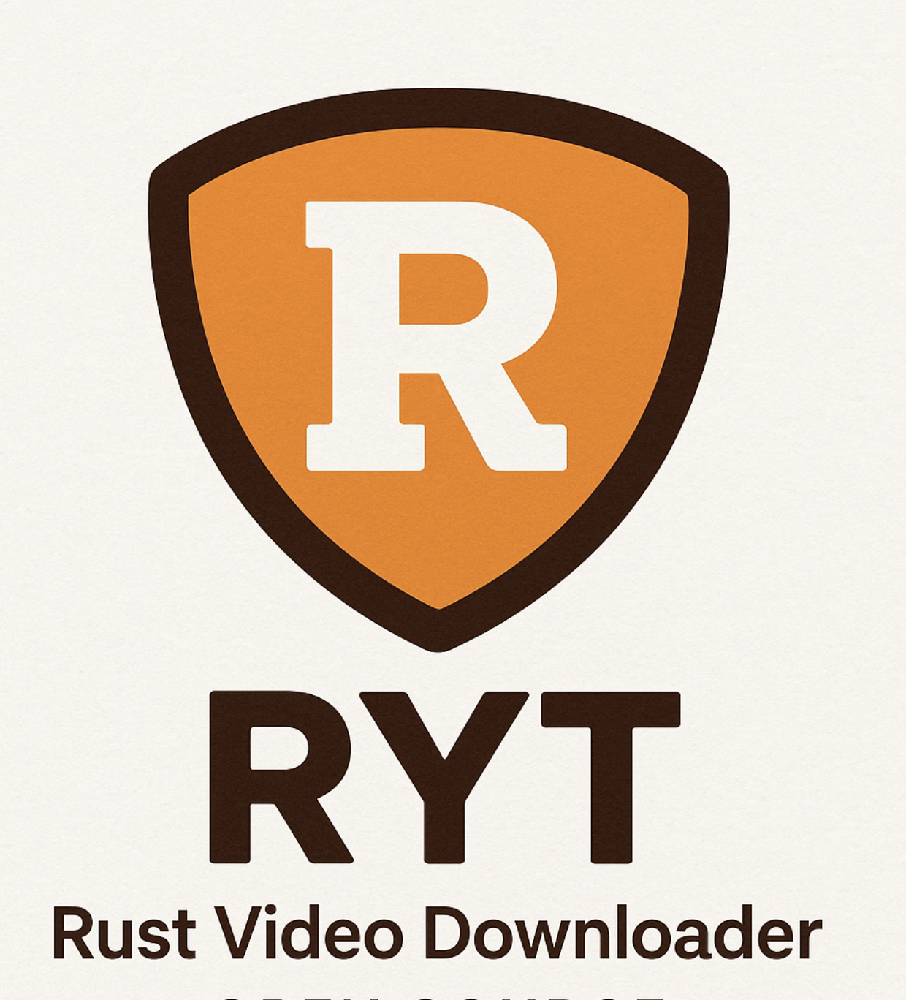

# RYT - Rust Video Downloader

<div align="center">
  
</div>

[](https://www.rust-lang.org)
[](LICENSE)
[](https://github.com/ytget/ryt/actions)
[](https://codecov.io/gh/ytget/ryt)
[](https://crates.io/crates/ryt)
[](https://crates.io/crates/ryt)
[](https://github.com/ytget/ryt)
[](https://github.com/ytget/ryt/security/dependabot)
[](https://github.com/ytget/ryt)
[](https://github.com/ytget/ryt)
[](https://github.com/ytget/ryt/issues)
[](https://github.com/ytget/ryt/pulls)
[](https://github.com/ytget/ryt)
[](https://github.com/ytget/ryt)
[](https://github.com/ytget/ryt)

Fast and reliable video downloader written in Rust.

## Features

- 🚀 **High Performance** - Native Rust code without GC overhead
- 🔒 **Memory Safety** - Guaranteed by Rust, no segfaults
- 🎯 **Type Safety** - Strong typing prevents runtime errors
- 📦 **Modular Architecture** - Easy to extend and maintain
- 🎨 **Modern CLI** - Intuitive interface with colored output
- 🔄 **Async I/O** - Efficient asynchronous operations
- 🛡️ **Botguard Protection** - Bypass bot detection mechanisms
- 📊 **Progress Bars** - Visual download progress tracking

## Installation

### From Source

```bash
git clone https://github.com/ytget/ryt.git
cd ryt
cargo build --release
```

The binary will be available at `target/release/ryt`.

### Using Cargo

```bash
cargo install --path .
```

## Quick Start

```bash
# Download video in best quality
ryt "VIDEO_URL"

# Download specific quality
ryt -f "height<=720" "VIDEO_URL"

# Download audio only
ryt -f "best" -e "mp3" "VIDEO_URL"
```

## Usage

### Command Line Options

```bash
ryt [OPTIONS] <URL>

Arguments:
  <URL>  Video or playlist URL

Options:
  -f, --format <FORMAT>          Format selector (e.g., 'itag=22', 'best', 'height<=480')
  -e, --ext <EXT>                Desired file extension (e.g., 'mp4', 'webm')
  -o, --output <PATH>            Output path (file or directory)
      --no-progress              Disable progress output
      --timeout <DURATION>       HTTP timeout (e.g., 30s, 1m) [default: 30s]
      --retries <RETRIES>        HTTP retries for transient errors [default: 3]
      --rate-limit <RATE>        Download rate limit (e.g., 2MiB/s, 500KiB/s)
      --playlist                 Treat input as playlist URL or ID
      --limit <LIMIT>            Max items to process for playlist (0 means all) [default: 0]
      --concurrency <CONCURRENCY> Parallelism for playlist downloads [default: 1]
      --botguard <BOTGUARD>      Botguard mode [default: off]
      --debug-botguard           Enable Botguard debug logs
      --client-name <NAME>       Innertube client name (default ANDROID)
      --client-version <VERSION> Innertube client version (default 20.10.38)
  -g, --print-url                Print final media URL and exit (no download)
      --user-agent <USER_AGENT>  Override User-Agent header
      --proxy <URL>              Proxy URL (http/https/socks)
  -v, --verbose                  Verbose output
  -q, --quiet                    Quiet output (only errors)
  -h, --help                     Print help
  -V, --version                  Print version
```

### Examples

```bash
# Download in best quality MP4
ryt -f "best" -e "mp4" "VIDEO_URL"

# Download playlist with limit
ryt --playlist --limit 10 "PLAYLIST_URL"

# Download with rate limiting
ryt --rate-limit "1MiB/s" "VIDEO_URL"

# Print URL only (no download)
ryt --print-url "VIDEO_URL"

# Download with Botguard protection
ryt --botguard auto "VIDEO_URL"
```

## Architecture

The project has a modular structure:

```
ryt/
├── src/
│   ├── main.rs              # CLI entry point
│   ├── lib.rs               # Core library
│   ├── error.rs             # Error types
│   ├── cli/                 # CLI interface
│   │   ├── args.rs          # Argument parsing
│   │   └── output.rs        # Output and progress
│   ├── core/                # Core logic
│   │   ├── downloader.rs    # High-level API
│   │   ├── video_info.rs    # Metadata structures
│   │   └── progress.rs      # Progress tracking
│   ├── platform/            # Platform API
│   │   ├── client.rs        # HTTP client
│   │   ├── innertube.rs     # API integration
│   │   ├── formats.rs       # Format parsing
│   │   ├── cipher.rs        # Signature decryption
│   │   └── botguard.rs      # Botguard protection
│   ├── download/            # Download system
│   │   ├── downloader.rs    # Chunked downloads
│   │   ├── progress.rs      # Download progress
│   │   └── retry.rs         # Retry logic
│   └── utils/               # Utilities
│       ├── url.rs           # URL parsing
│       ├── filename.rs      # Filename sanitization
│       ├── mime.rs          # MIME types
│       └── cache.rs         # Caching
```

## Development

### Running Tests

```bash
# Run all tests
cargo test

# Run tests with output
cargo test -- --nocapture

# Run specific test
cargo test test_name
```

### Code Coverage

Check test coverage locally:

```bash
# Install tarpaulin (once)
cargo install cargo-tarpaulin

# Generate HTML coverage report
cargo tarpaulin --out Html --output-dir coverage

# Open report in browser
open coverage/index.html  # macOS
xdg-open coverage/index.html  # Linux
```

The project uses [Codecov](https://codecov.io/gh/ytget/ryt) for tracking coverage:
- **Target**: 70% minimum coverage
- **Reports**: Automatic on every PR
- **Badge**: 

See [.codecov_setup.md](.codecov_setup.md) for setup instructions.

### Code Quality

```bash
cargo check
cargo clippy
cargo fmt
```

### Building

```bash
# Debug build
cargo build

# Release build
cargo build --release
```

### Using Makefile

```bash
make help      # Show available commands
make build     # Build release version
make test      # Run tests
make clippy    # Run linter
make fmt       # Format code
```

## Dependencies

- **tokio** - Async runtime
- **reqwest** - HTTP client
- **clap** - CLI parser
- **serde** - Serialization/deserialization
- **indicatif** - Progress bars
- **thiserror** - Typed errors
- **deno_core** - JavaScript execution for signature decryption

## CI/CD Pipeline

Every commit and PR is automatically checked by GitHub Actions:

| Check | Status | Description |
|-------|--------|-------------|
| **Tests** |  | Run on Ubuntu, macOS, Windows |
| **Clippy** | ✅ | Rust linter with strict mode |
| **Format** | ✅ | Code formatting check |
| **Coverage** |  | Minimum 70% required |
| **Build** | ✅ | Release builds on all platforms |

The CI ensures:
- ✅ All tests pass on multiple platforms
- ✅ No clippy warnings
- ✅ Consistent code formatting
- ✅ Adequate test coverage
- ✅ Successful release builds

## Project Status

✅ **Production Ready** - Core functionality is fully implemented

- [x] Project structure
- [x] CLI interface
- [x] Platform API client
- [x] Format parsing and selection
- [x] Download system
- [x] Signature decryption
- [x] Botguard protection
- [x] Testing (71/71 tests passing)
- [x] CI/CD Pipeline

## Contributing

Contributions are welcome! Please see [CONTRIBUTING.md](CONTRIBUTING.md) for details.

## License

This project is licensed under the MIT License - see the [LICENSE](LICENSE) file for details.

## Acknowledgments

This project is built with Rust for improved performance and memory safety.

## Support

- 📫 [Report Issues](https://github.com/ytget/ryt/issues)
- 💬 [Discussions](https://github.com/ytget/ryt/discussions)
- 📖 [Documentation](https://github.com/ytget/ryt/wiki)
